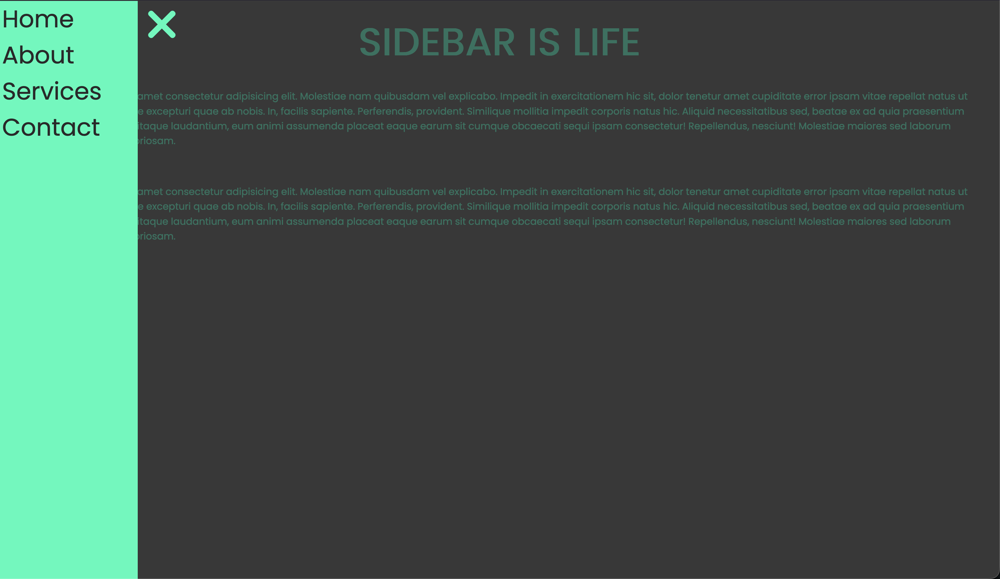

# ☰ SideNav Interactive - State & DOM Management

**Projet d'étude** focalisé sur la création d'une interface de navigation dynamique et la gestion d'états d'affichage en JavaScript natif.
Une implémentation de menu latéral (Sidebar) mettant l'accent sur la transition fluide et la logique d'interaction utilisateur.



## 🎯 Contexte & Objectifs Pédagogiques

Ce projet a été réalisé dans le cadre de mon **parcours de formation en autodidacte** pour approfondir la manipulation du DOM et la gestion des événements.

L'objectif principal était de s'éloigner des solutions CSS "pure" pour intégrer une logique JavaScript permettant un contrôle total sur le comportement des composants d'interface.

**Objectifs validés :**

- Maitrise de la **manipulation des classes** (`classList`) pour piloter le design via le script.
- Gestion des **écouteurs d'événements** (`click`) sur plusieurs cibles simultanées.
- Compréhension de la **spécificité CSS** et de la gestion des états (ouvert/fermé).
- Structuration d'une mise en page cohérente avec **Flexbox**.

## 🛠️ Stack Technique

- **Frontend :** HTML5, CSS3 (Transitions & Flexbox).
- **Scripting :** JavaScript Vanilla (ES6+).
- **Typographie :** Google Fonts (Integration externe).

## ✨ Fonctionnalités Développées

### 1. Contrôleur de Navigation (Burger Menu)
Développement d'un bouton interactif permettant de basculer l'état de la navigation. Le script gère dynamiquement l'ajout et la suppression des classes actives pour déclencher les animations de glissement.

### 2. Sidebar à État Dynamique
Mise en place d'une barre latérale positionnée hors écran, dont la visibilité est contrôlée par des transitions CSS fluides. L'interface s'adapte en temps réel aux commandes utilisateur.

### 3. Logique de Fermeture au Clic (UX Improvement)
Pour une expérience utilisateur plus intuitive, j'ai implémenté une fonction permettant de fermer la sidebar en cliquant n'importe où sur le contenu principal (`.content`), évitant ainsi de devoir cibler précisément le bouton de fermeture.

## 🏗️ Architecture du Code

Le code suit une structure simple visant à isoler les comportements :
- **index.js :** Centralise la détection des clics et l'orchestration des classes CSS.
- **style.css :** Définit les états visuels de base et les comportements de transition pour garantir une fluidité à 60 FPS.

## 🧠 Challenges Techniques Résolus

### La gestion des chevauchements d'événements
L'un des défis était de s'assurer que le clic sur le bouton burger ne soit pas "étouffé" par les autres éléments de la page.

- _Solution :_ Utilisation de sélecteurs ciblés et d'une logique conditionnelle en JavaScript pour s'assurer que chaque zone de clic (bouton vs contenu) déclenche la bonne action sur la sidebar.

### Maîtrise de la cascade CSS
Lors du développement, j'ai dû résoudre des problèmes de priorité où les styles de la sidebar n'étaient pas correctement modifiés par l'ajout de la classe active.

- _Solution :_ Approfondissement de la **spécificité des sélecteurs** pour garantir que les propriétés de transition (`left: 0`) prennent le dessus sur l'état initial lors de l'interaction.

## ⚙️ Installation & Lancement

Le projet est une application front-end pure, ne nécessitant aucune installation de dépendances.

1. **Cloner le dépôt :**
```bash
git clone [https://github.com/EnzoRouet/SideNav-Interactive]
```

2. **Lancer le projet :**
Ouvrez simplement le fichier index.html dans votre navigateur ou utilisez l'extension Live Server sur VS Code.
